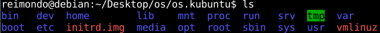

linux.iso custom made...
===

2015.1.10

>Write down quickly, from Franklin Weng's oral-copy. I have just tried kubuntu...

####Prepare

```bash
// su root
$su root
// Make a workspace
#mkdir os
// Copy one src-linux.iso into os
#cp linux.iso os
// Make a folder to mount the linux.iso and mount
#mkdir media && mount -o loop linux.iso media
// File mount in the media is read-only, cp to another file
#mkdir iso.linux && cp -af media iso.linux
```

####Main related directroy or file about iso.linux

```bash
iso.linux
|
+---casper
|   |
|   +---filesystem.squashfs----> Main system
|   |
|   +---initrd.lz----> Tiny-sys using when install...using BusyBox
|
|
+---isolinux----> some configure file?...we always need configure sth. when installing
|   +
|   |
|   \---lang
...
```

####Get core system

```bash
// Move filesystem.squashfs into os
#mv iso.linux/casper/filesystem.squashfs .
// Bring system from filesyste.squashfs into os.linux
#unsquashfs -d os.linux filesystem.squashfs

```



####Modify sth..
```bash
// You can chroot os.linux
#chroot os.linux
// We can mount some directory
// But U must umount before exit chroot
#mount -t proc none /proc
#mount --bind sys /sys
#mount --bind etc /etc
... // Forget...
// Add DNS if using apt-get
#echo "202.5.5.5" > etc/hostname  // Ali public DNS
// Modify thems related?
#cd os.linux/lib/plymouth/themes/
// When finishing, save it into iso.linux/casper
// Only one filesystem.squashfs in casper/
#cd os && mksquashfs os.linux iso.linux/casper/filesystem.squashfs

// Modify initrd.lz
// We use 7z
#apt-get install p7zip-full
// cd into casper
#cd os/iso.linux/casper
#7z x initrd.lz
// Create a tmp file to save initrd file
#mkdir TMP && cd TMP && cpio -i < ../initrd
// U can try modify themes?
#cd lib/plymouth/themes
// When finishing, save to initrd.lz
#find . | cpio -o -H newc | lzma -7 > ../initrd.lz
// Delete tmp files
#cd .. && rm -rf TMP initrd
```

####Make custom-made system into iso
```bash
// In iso.linux, using the following shell script
// I using #genisoimage in my debian-xfce
// Maybe using #mkisofs
// $start shell script
#!/bin/sh
NAME=$1

rm -f ../$NAME.iso

echo Generating iso files $NAME...

genisoimage -r -V "$NAME" --cache-inodes -J -l -b \
isolinux/isolinux.bin -c isolinux/boot.cat -no-emul-boot \
-boot-load-size 4 -boot-info-table -o ../$NAME.iso .
// $end shell script
#cd iso.linux && sh genisoimage.sh my_linux.iso
// DOWN! You can see a new my_linux.iso in os
```

####Task

- Try docker
- Explorer chroot
- Try `mksquashfs os.my_debian iso.debian/casper/filesystem.squashfs`
- U must prepare the following exams...... Orz

