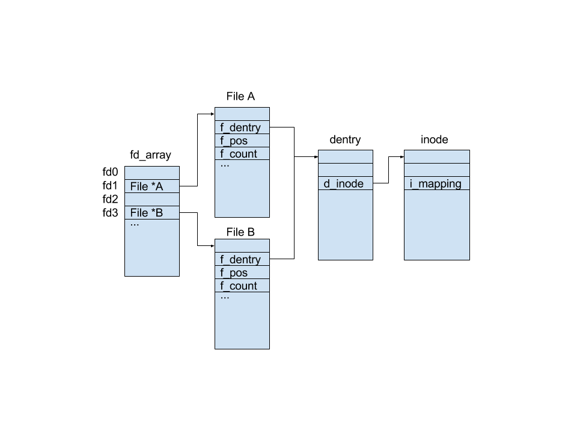

# sys_open
open()系统调用的服务例程为sys_open()函数，该函数接受的参数为：要打开的路径名filename、
访问模式的一些标志flags，以及如果该文件被创建所需要的权限掩码mode。如果该系统调用成功，就
返回一个文件文件描述符，也就是指向文件对象指针数组current->files->fd中分配给新文件的索引；
否则，返回-1。


## 原理分析
进程不直接与磁盘上的文件系统交互，而是与VFS交互，VFS再与具体的文件系统交互。sys_open的过程
反应了VFS中各个数据结构间的相互作用，也涉及VFS与具体文件系统的交互。

作为通用文件模型，VFS抽象出superblock对象、inode对象（CSAPP称为vnode）、file对象和
dentry对象：
- superblock: 存放已安装文件系统的有关信息，e.g. 对应于fs控制块，sb.inodes为所有索引节点
的链表；
- inode: 存放关于具体文件的一般信息，e.g. 对应于EXT4的inode，inode.i_size为文件字节数；
- dentry: 描述一个目录的信息。e.g. dentry.d_subdirs为子目录链表；
- file: 描述当前进程打开的文件的状态，e.g. file.f_pos记录位移量。
当一个具体的磁盘文件系统被挂载和访问时，VFS会根据该磁盘文件系统中的信息（超级块和inode）
在内存中构造出包含以上元素的更加丰满、高效和符合我们认知的文件系统。不同于磁盘中文件系统的
控制信息，VFS中的数据结构都是动态创建的且数量有限，e.g.dentry在文件第一次被访问时创建，
不用的dentry会被回收。

task_struct中与文件系统相关的变量有fs和files。fs维护着进程当前的根目录项和工作目录项，目
录所在文件系统等信息。files维护着进程当前打开的文件对象，如图：

若一个进程想打开一个文件，它便调用open系统调用。sys_open首先解析文件路径，如将/usr/src/
linux/fs/open.c解析为/、usr、src、linux、fs和open.c。然后从current->fs中的root或pwd
所标示的目录项开始搜索，直到找到open.c的目录项。dentry中有指向open.c的inode指针，inode
存有该文件的属性和文件数据。sys_open会创建一个file对象并关联到open.c的目录项。最后，
sys_open将file对象的指针存在current->files中的打开文件数组中，并返回它的索引。


## 源码分析

```c
long do_sys_open(int dfd, const char __user *filename, int flags, int mode)
{
	char *tmp = getname(filename);
	int fd = PTR_ERR(tmp);

	if (!IS_ERR(tmp)) {
		fd = get_unused_fd_flags(flags);
		if (fd >= 0) {
			struct file *f = do_filp_open(dfd, tmp, flags, mode, 0);
			if (IS_ERR(f)) {
				put_unused_fd(fd);
				fd = PTR_ERR(f);
			} else {
				fsnotify_open(f->f_path.dentry);
				fd_install(fd, f);
			}
		}
		putname(tmp);
	}
	return fd;
}
```

```c
struct file *do_filp_open(int dfd, const char *pathname,
		int open_flag, int mode, int acc_mode)
{
	struct file *filp;
	struct nameidata nd;
	int error;
	struct path path;
	struct dentry *dir;
	int count = 0;
	int will_write;
	int flag = open_to_namei_flags(open_flag);

	if (!acc_mode)
		acc_mode = MAY_OPEN | ACC_MODE(flag);

	/* O_TRUNC implies we need access checks for write permissions */
	if (flag & O_TRUNC)
		acc_mode |= MAY_WRITE;

	/* Allow the LSM permission hook to distinguish append 
	   access from general write access. */
	if (flag & O_APPEND)
		acc_mode |= MAY_APPEND;

	/*
	 * The simplest case - just a plain lookup.
	 */
	if (!(flag & O_CREAT)) {
		error = path_lookup_open(dfd, pathname, lookup_flags(flag),
					 &nd, flag);
		if (error)
			return ERR_PTR(error);
		goto ok;
	}

	/*
	 * Create - we need to know the parent.
	 */
	error = path_init(dfd, pathname, LOOKUP_PARENT, &nd);
	if (error)
		return ERR_PTR(error);
	error = path_walk(pathname, &nd);
	if (error) {
		if (nd.root.mnt)
			path_put(&nd.root);
		return ERR_PTR(error);
	}
	if (unlikely(!audit_dummy_context()))
		audit_inode(pathname, nd.path.dentry);

	/*
	 * We have the parent and last component. First of all, check
	 * that we are not asked to creat(2) an obvious directory - that
	 * will not do.
	 */
	error = -EISDIR;
	if (nd.last_type != LAST_NORM || nd.last.name[nd.last.len])
		goto exit_parent;

	error = -ENFILE;
	filp = get_empty_filp();
	if (filp == NULL)
		goto exit_parent;
	nd.intent.open.file = filp;
	nd.intent.open.flags = flag;
	nd.intent.open.create_mode = mode;
	dir = nd.path.dentry;
	nd.flags &= ~LOOKUP_PARENT;
	nd.flags |= LOOKUP_CREATE | LOOKUP_OPEN;
	if (flag & O_EXCL)
		nd.flags |= LOOKUP_EXCL;
	mutex_lock(&dir->d_inode->i_mutex);
	path.dentry = lookup_hash(&nd);
	path.mnt = nd.path.mnt;

do_last:
	error = PTR_ERR(path.dentry);
	if (IS_ERR(path.dentry)) {
		mutex_unlock(&dir->d_inode->i_mutex);
		goto exit;
	}

	if (IS_ERR(nd.intent.open.file)) {
		error = PTR_ERR(nd.intent.open.file);
		goto exit_mutex_unlock;
	}

	/* Negative dentry, just create the file */
	if (!path.dentry->d_inode) {
		/*
		 * This write is needed to ensure that a
		 * ro->rw transition does not occur between
		 * the time when the file is created and when
		 * a permanent write count is taken through
		 * the 'struct file' in nameidata_to_filp().
		 */
		error = mnt_want_write(nd.path.mnt);
		if (error)
			goto exit_mutex_unlock;
		error = __open_namei_create(&nd, &path, flag, mode);
		if (error) {
			mnt_drop_write(nd.path.mnt);
			goto exit;
		}
		filp = nameidata_to_filp(&nd, open_flag);
		if (IS_ERR(filp))
			ima_counts_put(&nd.path,
				       acc_mode & (MAY_READ | MAY_WRITE |
						   MAY_EXEC));
		mnt_drop_write(nd.path.mnt);
		if (nd.root.mnt)
			path_put(&nd.root);
		return filp;
	}

	/*
	 * It already exists.
	 */
	mutex_unlock(&dir->d_inode->i_mutex);
	audit_inode(pathname, path.dentry);

	error = -EEXIST;
	if (flag & O_EXCL)
		goto exit_dput;

	if (__follow_mount(&path)) {
		error = -ELOOP;
		if (flag & O_NOFOLLOW)
			goto exit_dput;
	}

	error = -ENOENT;
	if (!path.dentry->d_inode)
		goto exit_dput;
	if (path.dentry->d_inode->i_op->follow_link)
		goto do_link;

	path_to_nameidata(&path, &nd);
	error = -EISDIR;
	if (path.dentry->d_inode && S_ISDIR(path.dentry->d_inode->i_mode))
		goto exit;
ok:
	/*
	 * Consider:
	 * 1. may_open() truncates a file
	 * 2. a rw->ro mount transition occurs
	 * 3. nameidata_to_filp() fails due to
	 *    the ro mount.
	 * That would be inconsistent, and should
	 * be avoided. Taking this mnt write here
	 * ensures that (2) can not occur.
	 */
	will_write = open_will_write_to_fs(flag, nd.path.dentry->d_inode);
	if (will_write) {
		error = mnt_want_write(nd.path.mnt);
		if (error)
			goto exit;
	}
	error = may_open(&nd.path, acc_mode, flag);
	if (error) {
		if (will_write)
			mnt_drop_write(nd.path.mnt);
		goto exit;
	}
	filp = nameidata_to_filp(&nd, open_flag);
	if (IS_ERR(filp))
		ima_counts_put(&nd.path,
			       acc_mode & (MAY_READ | MAY_WRITE | MAY_EXEC));
	/*
	 * It is now safe to drop the mnt write
	 * because the filp has had a write taken
	 * on its behalf.
	 */
	if (will_write)
		mnt_drop_write(nd.path.mnt);
	if (nd.root.mnt)
		path_put(&nd.root);
	return filp;

exit_mutex_unlock:
	mutex_unlock(&dir->d_inode->i_mutex);
exit_dput:
	path_put_conditional(&path, &nd);
exit:
	if (!IS_ERR(nd.intent.open.file))
		release_open_intent(&nd);
exit_parent:
	if (nd.root.mnt)
		path_put(&nd.root);
	path_put(&nd.path);
	return ERR_PTR(error);

do_link:
	error = -ELOOP;
	if (flag & O_NOFOLLOW)
		goto exit_dput;
	/*
	 * This is subtle. Instead of calling do_follow_link() we do the
	 * thing by hands. The reason is that this way we have zero link_count
	 * and path_walk() (called from ->follow_link) honoring LOOKUP_PARENT.
	 * After that we have the parent and last component, i.e.
	 * we are in the same situation as after the first path_walk().
	 * Well, almost - if the last component is normal we get its copy
	 * stored in nd->last.name and we will have to putname() it when we
	 * are done. Procfs-like symlinks just set LAST_BIND.
	 */
	nd.flags |= LOOKUP_PARENT;
	error = security_inode_follow_link(path.dentry, &nd);
	if (error)
		goto exit_dput;
	error = __do_follow_link(&path, &nd);
	if (error) {
		/* Does someone understand code flow here? Or it is only
		 * me so stupid? Anathema to whoever designed this non-sense
		 * with "intent.open".
		 */
		release_open_intent(&nd);
		if (nd.root.mnt)
			path_put(&nd.root);
		return ERR_PTR(error);
	}
	nd.flags &= ~LOOKUP_PARENT;
	if (nd.last_type == LAST_BIND)
		goto ok;
	error = -EISDIR;
	if (nd.last_type != LAST_NORM)
		goto exit;
	if (nd.last.name[nd.last.len]) {
		__putname(nd.last.name);
		goto exit;
	}
	error = -ELOOP;
	if (count++==32) {
		__putname(nd.last.name);
		goto exit;
	}
	dir = nd.path.dentry;
	mutex_lock(&dir->d_inode->i_mutex);
	path.dentry = lookup_hash(&nd);
	path.mnt = nd.path.mnt;
	__putname(nd.last.name);
	goto do_last;
}
```